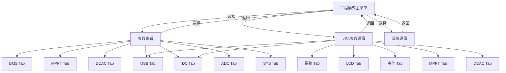

# 工程模式 (Engineering Mode) UI 实现规范 v2

本文档为在 **EEZ Studio** 中创建**工程模式**界面，提供完整的布局指南、配色方案、变量定义及数据绑定指南。

---

## 0. 整体架构概述

### 0.1 三大功能模块

进入工程模式后，首先显示**主菜单**，包含三个选项：

```
┌──────────────────────────────────────┐
│          SYSTEM ENG MODE      [EXIT] │
│                                      │
│   ┌──────────────────────────────┐   │
│   │  1. 参数查看 (PARAM VIEW)    │   │
│   └──────────────────────────────┘   │
│   ┌──────────────────────────────┐   │
│   │  2. 记忆参数设置 (PARAM SET) │   │
│   └──────────────────────────────┘   │
│   ┌──────────────────────────────┐   │
│   │  3. 系统设置 (SYS SET)       │   │
│   └──────────────────────────────┘   │
└──────────────────────────────────────┘
```

### 0.2 页面导航结构



---

## 1. 配色方案与视觉规范

- **屏幕尺寸**：320x240 像素（横屏）
- **主题风格**：暗色模式
- **字体选择**：
  - BarlowCondensed-Regular-26：标题及大型数值
  - LVGL 默认 14px：标签及普通文本
  - LVGL 默认 12px：Tab 标签

### 配色方案

| 颜色名称 | 十六进制代码 | 用途 |
| :--- | :--- | :--- |
| **背景色** | `#0F131A` | 页面主背景 |
| **卡片填充色** | `#1A202C` | 数据模块/网格背景 |
| **边框/网格线** | `#2D3748` | 卡片边框及分割线 |
| **BMS 强调色** | `#00E676` | BMS 相关标题/指标 |
| **MPPT 强调色** | `#00E5FF` | MPPT 相关标题/指标 |
| **DCAC 强调色** | `#FFB300` | DCAC 相关标题/指标 |
| **SYS 强调色** | `#718096` | 系统信息标题/指标 |
| **主文本色** | `#FFFFFF` | 数据数值 |
| **次文本色** | `#718096` | 标题/标签 |
| **选中高亮色** | `#00E5FF` | 选中菜单项/Tab 高亮 |
| **菜单项背景** | `#1E293B` | 菜单/列表项背景 |
| **选中项背景** | `#0D2847` | 选中菜单项背景 |

---

## 2. 页面 0：工程模式主菜单

### 布局

- **标题栏**（高度 24px）：
  - 标题：`ENG MODE`（左对齐，BarlowCondensed-26，白色）
  - EXIT 按钮：（右对齐，50x18px，LVGL Button，文本 `EXIT`）

- **菜单区域**（y=32, 高度 200px）：
  - 3 个菜单项，纵向排列，每项高度 48px，间距 8px
  - 菜单项样式：背景 `#1E293B`，圆角 6px
  - 选中样式：背景 `#0D2847`，左边框 3px `#00E5FF`

### 菜单项内容

| 序号 | 标题 | 副标题 | 颜色 |
|:---:|:---|:---|:---|
| 1 | `PARAM VIEW` | 实时遥测数据查看 | `#00E676` |
| 2 | `PARAM SET` | 记忆参数配置 | `#FFB300` |
| 3 | `SYS SET` | 保存/重置/升级 | `#00E5FF` |

### 交互逻辑

- UP/DOWN 按键切换选中项（高亮移动）
- ENTER 按键进入对应子页面
- EXIT 按键退出工程模式，返回主工作界面

---

## 3. 页面 1：参数查看 (Param View)

进入后显示各模块的实时遥测数据，通过**左右滑动或左右按键**切换不同 Tab。

### 3.1 通用页面框架

- **标题栏**（高度 24px）：
  - 左侧：`< BACK` 返回按钮（点击返回主菜单）
  - 中央：Tab 标题（当前选中的模块名）
  - 右侧：Tab 指示器（`● ● ● ●` 小圆点，当前页高亮）

- **Tab 栏**（底部 16px）：
  - 7 个 Tab：`BMS` | `MPPT` | `DCAC` | `USB` | `DC` | `ADC` | `SYS`
  - Tab 指示条：底部 2px 线条，选中 Tab 用对应强调色

- **内容区域**：y=28 ~ y=220，左右 8px 边距

### 3.2 Tab 1：BMS 参数查看

标题颜色：`#00E676`

**数据来源**：`tBmsRx`（接收数据）+ `tBms`（任务对象）

| 行 | 左列标签 | 左列变量 | 右列标签 | 右列变量 |
|:---:|:---|:---|:---|:---|
| 1 | `V_pack` | `tBmsRx.tDevInfo[0].usVolt * 0.01f` -> `%.2fV` | `I_pack` | `tBmsRx.tDevInfo[0].sCurr * 0.01f` -> `%.2fA` |
| 2 | `SOC` | `tBmsRx.tDevInfo[0].usSOC` -> `%u%%` | `Cycle` | `tBmsRx.tDevInfo[0].usCycleCnt` -> `%u` |
| 3 | `T_max` | `tBmsRx.tDevInfo[0].sMaxTemp` -> `%d°C` | `T_min` | `tBmsRx.tDevInfo[0].sMinTemp` -> `%d°C` |
| 4 | `T_board` | `tBmsRx.tDevInfo[0].sBoardTempMax` -> `%d°C` | `Cap` | `tBmsRx.tDevInfo[0].usCalcCapAH * 0.1f` -> `%.1fAH` |
| 5 | `Online` | `tBmsRx.tDevNum.ucOnlineNum` -> `%u` | `State` | `tBms.eWorkState` -> `DISG/CHG/NULL` |
| 6 | `ChgFull` | `tBmsRx.usChgFullTime` -> `%umin` | `DisEmpty` | `tBmsRx.usDisChgEmptyTime` -> `%umin` |
| 7 | `PermChgPwr` | `tBmsRx.usPermMaxChgPwr` -> `%uW` | `ErrCode` | `tBmsRx.tDevInfo[0].uErrCode.ulCode` -> `0x%08X` |

### 3.3 Tab 2：MPPT 参数查看

标题颜色：`#00E5FF`

**数据来源**：`tMpptRx`（接收数据）+ `tMppt`（任务对象）

| 行 | 左列标签 | 左列变量 | 右列标签 | 右列变量 |
|:---:|:---|:---|:---|:---|
| 1 | `V_pv_in` | `tMpptRx.usInVolt * 0.1f` -> `%.1fV` | `I_pv_in` | `tMpptRx.usInCurr * 0.01f` -> `%.2fA` |
| 2 | `P_pv_in` | `tMpptRx.usInPwr * 0.1f` -> `%.1fW` | `P_out` | `tMpptRx.usOutPwr * 0.1f` -> `%.1fW` |
| 3 | `V_out` | `tMpptRx.usOutVolt * 0.1f` -> `%.1fV` | `I_out` | `tMpptRx.usOutCurr * 0.01f` -> `%.2fA` |
| 4 | `P_max` | `tMpptRx.usMaxInPwr * 0.1f` -> `%.1fW` | `Temp` | `tMpptRx.sMaxTemp` -> `%d°C` |
| 5 | `InType` | `tMpptRx.uInType` -> `PV/DC/NULL` | `WorkMode` | `tMppt.eWorkMode` -> `PV/DC/NULL` |
| 6 | `ChgPerm` | `tMppt.bChgPerm` -> `Y/N` | `ErrCode` | `tMpptRx.uErrCode.usCode` -> `0x%04X` |

### 3.4 Tab 3：DCAC 参数查看

标题颜色：`#FFB300`

**数据来源**：`tDcacRx`（接收数据）+ `tDcac`（任务对象）

| 行 | 左列标签 | 左列变量 | 右列标签 | 右列变量 |
|:---:|:---|:---|:---|:---|
| 1 | `V_ac_in` | `tDcacRx.usInVolt * 0.1f` -> `%.1fV` | `I_ac_in` | `tDcacRx.usInCurr * 0.1f` -> `%.1fA` |
| 2 | `P_ac_in` | `tDcacRx.usInPwr` -> `%uW` | `F_ac_in` | `tDcacRx.usInFreq * 0.1f` -> `%.1fHz` |
| 3 | `V_ac_out` | `tDcacRx.usOutVolt * 0.1f` -> `%.1fV` | `I_ac_out` | `tDcacRx.usOutCurr * 0.1f` -> `%.1fA` |
| 4 | `P_ac_out` | `tDcacRx.usOutPwr` -> `%uW` | `F_ac_out` | `tDcacRx.usOutFreq * 0.1f` -> `%.1fHz` |
| 5 | `P_chg` | `tDcacRx.usChgPwr` -> `%dW` | `P_max_in` | `tDcacRx.usMaxInPwr` -> `%uW` |
| 6 | `T_max` | `tDcacRx.sMaxTemp` -> `%d°C` | `T_min` | `tDcacRx.sMinTemp` -> `%d°C` |
| 7 | `ChgSt` | `tDcac.eChgState` -> `WORK/OFF` | `DisChgSt` | `tDcac.eDisChgState` -> `WORK/OFF` |
| 8 | `State` | `tDcacRx.uState.usState` -> `0x%04X` | `ErrCode` | `tDcacRx.uErrCode.usCode[0]` -> `0x%04X` |

### 3.5 Tab 4：USB 参数查看

标题颜色：`#9C27B0`

**数据来源**：`tUsb`（任务对象）

| 行 | 左列标签 | 左列变量 | 右列标签 | 右列变量 |
|:---:|:---|:---|:---|:---|
| 1 | `V_in` | `tUsb.usInVolt * 0.1f` -> `%.1fV` | `I_in` | `tUsb.usInCurr * 0.1f` -> `%.1fA` |
| 2 | `P_out` | `tUsb.usOutPwr` -> `%uW` | `P_wc` | `tUsb.usWcPwr` -> `%uW` |
| 3 | `P_pd` | `tUsb.usPdPwr` -> `%uW` | `Temp` | `tUsb.sMaxTemp` -> `%d°C` |
| 4 | `State` | `tUsb.eDevState` -> `ON/OFF/ERR` | `ErrCode` | `tUsb.uErrCode.ucErrCode` -> `0x%02X` |

### 3.6 Tab 5：DC 参数查看

标题颜色：`#FF5722`

**数据来源**：`tDc`（任务对象）

| 行 | 左列标签 | 左列变量 | 右列标签 | 右列变量 |
|:---:|:---|:---|:---|:---|
| 1 | `V_in` | `tDc.usInVolt * 0.1f` -> `%.1fV` | `I_in` | `tDc.usInCurr * 0.1f` -> `%.1fA` |
| 2 | `V_out` | `tDc.usOutVolt * 0.1f` -> `%.1fV` | `I_out` | `tDc.usOutCurr * 0.1f` -> `%.1fA` |
| 3 | `P_out` | `tDc.usOutPwr` -> `%uW` | `Temp` | `tDc.sMaxTemp` -> `%d°C` |
| 4 | `State` | `tDc.eDevState` -> `ON/OFF/ERR` | `ErrCode` | `tDc.uErrCode.ucErrCode` -> `0x%02X` |

### 3.7 Tab 6：ADC 参数查看

标题颜色：`#E91E63`

**数据来源**：`tAdcSamp`（ADC 采样数据）

| 行 | 左列标签 | 左列变量 | 右列标签 | 右列变量 |
|:---:|:---|:---|:---|:---|
| 1 | `V_sys` | `tAdcSamp.usSysInVolt * 0.01f` -> `%.2fV` | `KeyPwr` | `tAdcSamp.usKeyPower` -> `%u` (AD) |
| 2 | `DC_Temp` | `tAdcSamp.sDcOutTemp` -> `%d°C` | `DC_Curr` | `tAdcSamp.fDcOutCurr` -> `%.2fA` |
| 3 | `DC_Vout` | `tAdcSamp.usDcOutVolt * 0.1f` -> `%.1fV` | | |
| 4 | `DC_Vin1` | `tAdcSamp.usDcIn1Volt * 0.1f` -> `%.1fV` | `DC_Vin2` | `tAdcSamp.usDcIn2Volt * 0.1f` -> `%.1fV` |

### 3.8 Tab 7：SYS 参数查看

标题颜色：`#718096`

**数据来源**：`tSysInfo` + `tAppMemParam` + 系统信息

| 行 | 左列标签 | 左列变量 | 右列标签 | 右列变量 |
|:---:|:---|:---|:---|:---|
| 1 | `Uptime` | `xTaskGetTickCount()` 计算 -> `%ud %02uh %02um` | `ErrCode` | `tSysInfo.uErrCode` -> `0x%08X` |
| 2 | `Version` | `tAppMemParam.tVerInfo.saVersion` -> 字符串 | | |
| 3 | `BuildDate` | `tAppMemParam.tVerInfo.saBuildDate` -> 字符串 | | |
| 4 | `BoardTemp` | `tAdcSamp.sDcOutTemp` -> `%d°C` | `UsbTemp` | `tAdcSamp.sUsbTemp` -> `%d°C` |
| 5 | `SysVolt` | `tAdcSamp.usSysInVolt * 0.01f` -> `%.2fV` | `FanMode` | `eFan_GetWorkMode()` -> `ON/OFF/AUTO` |

---

## 4. 页面 2：记忆参数设置 (Param Set)

进入后显示各模块的记忆参数配置，通过**左右滑动或左右按键**切换不同 Tab。该功能基于现有的 `v_sys_queue_task_eng` 和 `tEngMode` 实现。

### 4.1 通用页面框架

- **标题栏**（高度 24px）：
  - 左侧：`< BACK` 返回按钮
  - 中央：Tab 标题
  - 右侧：Tab 指示器

- **Tab 栏**（底部 16px）：
  - 7 个 Tab：`SYS` | `LCD` | `BAT` | `MPPT` | `DCAC` | `USB` | `DC`
  - 标签使用 12px 字体，超出屏幕宽度时左右滑动

- **内容区域**：参数列表形式，每行一个参数
- **编辑交互**：选中某参数后，UP/DOWN 按键调整数值（长按快速调整）

### 4.2 Tab 1：系统参数 (SYS)

对应旧版 `EMS_SYS`，数据来源：`tAppMemParam.tSYS`

| 序号 | 参数名 | 变量 | 范围 | 步进 | 单位 |
|:---:|:---|:---|:---|:---|:---|
| 0 | 版本号 | `tAppMemParam.tVerInfo.saVersion`（只读） | - | - | - |
| 1 | 风扇控制 | `tEngMode.cEngModeState` | 0~1 | 1 | 0=关 1=开 |
| 2 | 自动关机时间 | `tAppMemParam.tSYS.usAutoOffTime` | 0~65535 | 1 | min |
| 3 | 最高温度阈值 | `tAppMemParam.tSYS.sMaxTemp` | -20~100 | 1 | °C |
| 4 | 最低温度阈值 | `tAppMemParam.tSYS.sMinTemp` | -20~100 | 1 | °C |
| 5 | 最低开机电压 | `tAppMemParam.tSYS.usMinOpenVolt` | 0~65535 | 1 | 0.01V |
| 6 | 蜂鸣器开关 | `tAppMemParam.tSYS.bBuzSwitchOff` | 0~1 | 1 | 0=开 1=关 |

### 4.3 Tab 2：LCD 参数 (LCD)

对应旧版 `EMS_LCD`，数据来源：`tAppMemParam.tDISP`

| 序号 | 参数名 | 变量 | 范围 | 步进 |
|:---:|:---|:---|:---|:---|
| 0 | 高亮度值 | `tAppMemParam.tDISP.ucHighLightValue` | 0x88~0x8F | 1 |
| 1 | 低亮度值 | `tAppMemParam.tDISP.ucLowLightValue` | 0x88~0x8F | 1 |
| 2 | 自动关屏时间 | `tAppMemParam.tDISP.usAutoOffTime` | 0~65535 | 1 (min) |

### 4.4 Tab 3：电池参数 (BAT)

对应旧版 `EMS_BAT`，数据来源：`tAppMemParam.tBMS`

| 序号 | 参数名 | 变量 | 范围 | 步进 | 单位 |
|:---:|:---|:---|:---|:---|:---|
| 0 | 充电最高温度 | `tAppMemParam.tBMS.cChgMaxTemp` | -20~100 | 1 | °C |
| 1 | 放电最高温度 | `tAppMemParam.tBMS.cDisChgMaxTemp` | -20~100 | 1 | °C |
| 2 | 充电最低温度 | `tAppMemParam.tBMS.cChgMinTemp` | -20~100 | 1 | °C |
| 3 | 放电最低温度 | `tAppMemParam.tBMS.cDisChgMinTemp` | -20~100 | 1 | °C |
| 4 | 最高电压 | `tAppMemParam.tBMS.usMaxVolt` | 0~65535 | 1 | 0.01V |
| 5 | 最低电压 | `tAppMemParam.tBMS.usMinVolt` | 0~65535 | 1 | 0.01V |

### 4.5 Tab 4：MPPT 参数 (MPPT)

对应旧版 `EMS_MPPT`，数据来源：`tAppMemParam.tMPPT`

| 序号 | 参数名 | 变量 | 范围 | 步进 | 单位 |
|:---:|:---|:---|:---|:---|:---|
| 0 | 自动关机时间 | `tAppMemParam.tMPPT.usAutoOffTime` | 0~65535 | 1 | min |
| 1 | 允许最高温度 | `tAppMemParam.tMPPT.cAllowMaxTemp` | -20~100 | 1 | °C |
| 2 | 最高输入电压 | `tAppMemParam.tMPPT.usMaxInVolt` | 0~65535 | 1 | 0.1V |
| 3 | 最低输入电压 | `tAppMemParam.tMPPT.usMinInVolt` | 0~65535 | 1 | 0.1V |
| 4 | 输入功率额定值 | `tAppMemParam.tMPPT.usInPwrRating` | 0~65535 | 1 | 0.1W |

### 4.6 Tab 5：DCAC 参数 (DCAC)

对应旧版 `EMS_DCAC`，数据来源：`tAppMemParam.tDCAC`

| 序号 | 参数名 | 变量 | 范围 | 步进 | 单位 |
|:---:|:---|:---|:---|:---|:---|
| 0 | 自动关机时间 | `tAppMemParam.tDCAC.usAutoOffTime` | 0~65535 | 1 | min |
| 1 | 最低开机电压 | `tAppMemParam.tDCAC.usMinOpenVolt` | 0~65535 | 1 | 0.01V |
| 2 | 额定电压 | `tAppMemParam.tDCAC.usVoltRating` | 0~65535 | 1 | 0.1V |
| 3 | 最高输入电压 | `tAppMemParam.tDCAC.usMaxInVolt` | 0~65535 | 1 | 0.01V |
| 4 | 最低输入电压 | `tAppMemParam.tDCAC.usMinInVolt` | 0~65535 | 1 | 0.01V |
| 5 | 输入功率额定值 | `tAppMemParam.tDCAC.usInPwrRating` | 0~65535 | 1 | W |
| 6 | 最小输入功率 | `tAppMemParam.tDCAC.usMinInPwr` | 0~65535 | 1 | W |
| 7 | 最大输入电流 | `tAppMemParam.tDCAC.usMaxInCurr` | 0~65535 | 1 | 0.1A |
| 8 | 输出功率额定值 | `tAppMemParam.tDCAC.usOutPwrRating` | 0~65535 | 1 | W |
| 9 | 过载功率 | `tAppMemParam.tDCAC.usOverLoadPwr` | 0~65535 | 1 | W |
| 10 | 并网功率 | `tAppMemParam.tDCAC.usParaInPwr` | 0~65535 | 1 | W |
| 11 | 输出频率 | `tAppMemParam.tDCAC.usAcOutFreq` | 0~65535 | 1 | 0.01Hz |
| 12 | 最高温度 | `tAppMemParam.tDCAC.sMaxTemp` | -20~100 | 1 | °C |

### 4.7 Tab 6：USB 参数 (USB)

对应旧版 `EMS_USB`，数据来源：`tAppMemParam.tUSB`

| 序号 | 参数名 | 变量 | 范围 | 步进 | 单位 |
|:---:|:---|:---|:---|:---|:---|
| 0 | 自动关机时间 | `tAppMemParam.tUSB.usAutoOffTime` | 0~65535 | 1 | min |
| 1 | 最高输入电压 | `tAppMemParam.tUSB.usMaxInVolt` | 0~65535 | 1 | 0.01V |
| 2 | 最低输入电压 | `tAppMemParam.tUSB.usMinInVolt` | 0~65535 | 1 | 0.01V |
| 3 | 最低开机电压 | `tAppMemParam.tUSB.usMinOpenVolt` | 0~65535 | 1 | 0.01V |
| 4 | 最高温度 | `tAppMemParam.tUSB.sMaxTemp` | -20~100 | 1 | °C |

### 4.8 Tab 7：DC 参数 (DC)

对应旧版 `EMS_DC`，数据来源：`tAppMemParam.tDC`

| 序号 | 参数名 | 变量 | 范围 | 步进 | 单位 |
|:---:|:---|:---|:---|:---|:---|
| 0 | 自动关机时间 | `tAppMemParam.tDC.usAutoOffTime` | 0~65535 | 1 | min |
| 1 | 最高输出电压 | `tAppMemParam.tDC.usMaxOutVolt` | 0~65535 | 1 | 0.01V |
| 2 | 最低输出电压 | `tAppMemParam.tDC.usMinOutVolt` | 0~65535 | 1 | 0.01V |
| 3 | 过载功率 | `tAppMemParam.tDC.usOverLoadPwr` | 0~65535 | 1 | W |
| 4 | 最低开机电压 | `tAppMemParam.tDC.usMinOpenVolt` | 0~65535 | 1 | 0.01V |
| 5 | 最高温度 | `tAppMemParam.tDC.sMaxTemp` | -20~100 | 1 | °C |

### 4.9 记忆参数设置与 `tEngMode` 的映射关系

记忆参数设置功能复用现有的 `v_sys_queue_task_eng` 后台逻辑：

```c
// UI 层选择 Tab 时，同步设置 tEngMode 的步骤
tEngMode.ucEngModeItem = ui_selected_item_index;  // 当前 Tab 内选中的参数序号
tEngMode.cEngModeState = 0;                        // 状态重置

// UP/DOWN 按键调整参数时
vBms_MemParamSet(item, add);   // BMS 参数调整
vMppt_MemParamSet(item, add);  // MPPT 参数调整
vDcac_MemParamSet(item, add);  // DCAC 参数调整
vSys_MemParamSet(item, add);   // SYS 参数调整
// LCD/USB/DC 参数调整函数同理
```

---

## 5. 页面 3：系统设置 (Sys Set)

对应旧版 `EMS_SET`，包含 3 个操作按钮。

### 布局

```
┌──────────────────────────────────────┐
│ < BACK        SYS SET          ● ● ● │
├──────────────────────────────────────┤
│                                      │
│   ┌──────────────────────────────┐   │
│   │  ? SAVE & EXIT              │   │
│   │  保存参数并退出工程模式       │   │
│   └──────────────────────────────┘   │
│                                      │
│   ┌──────────────────────────────┐   │
│   │  ? RESET DEFAULTS           │   │
│   │  恢复出厂默认参数             │   │
│   └──────────────────────────────┘   │
│                                      │
│   ┌──────────────────────────────┐   │
│   │  ? FIRMWARE UPDATE           │   │
│   │  跳转到 Bootloader 升级模式  │   │
│   └──────────────────────────────┘   │
└──────────────────────────────────────┘
```

### 操作说明

| 序号 | 操作 | 对应旧版逻辑 | 执行代码 |
|:---:|:---|:---|:---|
| 0 | SAVE & EXIT | `EMS_SET item=0` | `bApp_MemParamUpdate(NULL,NULL,false)` 后 `cSys_Switch(SO_KEY, ST_OFF, false)` |
| 1 | RESET DEFAULTS | `EMS_SET item=1` | `bApp_SysInfoInit(true)` 后 `cSys_Switch(SO_KEY, ST_OFF, false)` |
| 2 | FIRMWARE UPDATE | `EMS_SET item=2` | `vApp_JumpToBoot(mainUPDATE_FLAG)` |

### 确认对话框

选择任一操作后，弹出确认对话框：
```
┌─────────────────────────┐
│  确认保存并退出？        │
│                         │
│   [ 确认 ]   [ 取消 ]   │
└─────────────────────────┘
```

---

## 6. EEZ Studio 变量定义

### 6.1 参数查看页面变量（字符串类型）

在 EEZ Studio 的 **Variables** 选项卡中定义以下变量，用于参数查看页面的数据绑定：

| 变量名 | 类型 | 用途 |
| :--- | :--- | :--- |
| `uca_pv_bms_volt_curr` | `string` | BMS: 电压/电流 |
| `uca_pv_bms_soc_cycle` | `string` | BMS: SOC/循环次数 |
| `uca_pv_bms_temp` | `string` | BMS: 最高/最低温度 |
| `uca_pv_bms_cap_state` | `string` | BMS: 容量/状态 |
| `uca_pv_bms_online_err` | `string` | BMS: 在线数/错误码 |
| `uca_pv_bms_time` | `string` | BMS: 充满/放空时间 |
| `uca_pv_bms_perm_pwr` | `string` | BMS: 许可充电功率 |
| `uca_pv_mppt_pv_v_i` | `string` | MPPT: PV 输入电压/电流 |
| `uca_pv_mppt_pwr` | `string` | MPPT: 输入/输出功率 |
| `uca_pv_mppt_out_v_i` | `string` | MPPT: 输出电压/电流 |
| `uca_pv_mppt_max_temp` | `string` | MPPT: 最大功率/温度 |
| `uca_pv_mppt_type_err` | `string` | MPPT: 输入类型/错误码 |
| `uca_pv_dcac_in_v_i` | `string` | DCAC: 输入电压/电流 |
| `uca_pv_dcac_in_p_f` | `string` | DCAC: 输入功率/频率 |
| `uca_pv_dcac_out_v_i` | `string` | DCAC: 输出电压/电流 |
| `uca_pv_dcac_out_p_f` | `string` | DCAC: 输出功率/频率 |
| `uca_pv_dcac_chg_max` | `string` | DCAC: 充电功率/最大输入 |
| `uca_pv_dcac_temp` | `string` | DCAC: 最高/最低温度 |
| `uca_pv_dcac_state` | `string` | DCAC: 充放电状态 |
| `uca_pv_dcac_err` | `string` | DCAC: 状态字/错误码 |
| `uca_pv_usb_v_i` | `string` | USB: 输入电压/电流 |
| `uca_pv_usb_pwr` | `string` | USB: 输出/快充/PD 功率 |
| `uca_pv_usb_temp_err` | `string` | USB: 温度/状态/错误码 |
| `uca_pv_dc_in_v_i` | `string` | DC: 输入电压/电流 |
| `uca_pv_dc_out_v_i` | `string` | DC: 输出电压/电流 |
| `uca_pv_dc_pwr_err` | `string` | DC: 功率/温度/错误码 |
| `uca_pv_adc_sys_key` | `string` | ADC: 系统电压/按键电源 |
| `uca_pv_adc_dc_temp_curr` | `string` | ADC: DC温度/电流 |
| `uca_pv_adc_dc_vout` | `string` | ADC: DC输出电压 |
| `uca_pv_adc_dc_vin` | `string` | ADC: DC输入电压1/2 |
| `uca_pv_sys_uptime` | `string` | SYS: 运行时间/错误码 |
| `uca_pv_sys_ver` | `string` | SYS: 固件版本 |
| `uca_pv_sys_build` | `string` | SYS: 编译日期 |
| `uca_pv_sys_temp` | `string` | SYS: 板载温度 |
| `uca_pv_sys_volt_fan` | `string` | SYS: 系统电压/风扇 |

### 6.2 记忆参数页面变量（字符串类型）

用于显示当前选中的参数值：

| 变量名 | 类型 | 用途 |
| :--- | :--- | :--- |
| `uca_ps_tab_title` | `string` | 当前 Tab 标题 |
| `uca_ps_param_label` | `string` | 当前参数名 |
| `uca_ps_param_value` | `string` | 当前参数值（带单位） |
| `uca_ps_param_list` | `string` | 参数列表（多行文本） |

---

## 7. C 语言数据映射

### 7.1 参数查看数据格式化函数

```c
/***********************************************************************************************************************
 * 函数功能    : 格式化参数查看页面数据
 * 说明(备注)  : 在显示任务周期性调用，更新所有参数查看页面的变量
 ************************************************************************************************************************/
void v_eng_param_view_update(void)
{
    char buf[48];

    /* ========== BMS Tab ========== */
    // 行1: V_pack / I_pack
    snprintf(buf, sizeof(buf), "V: %.2fV", tBmsRx.tDevInfo[0].usVolt * 0.01f);
    set_var_uca_pv_bms_volt_curr(buf);

    // 行2: SOC / Cycle
    snprintf(buf, sizeof(buf), "S:%u%% C:%u", tBmsRx.tDevInfo[0].usSOC, tBmsRx.tDevInfo[0].usCycleCnt);
    set_var_uca_pv_bms_soc_cycle(buf);

    // 行3: T_max / T_min
    snprintf(buf, sizeof(buf), "H:%d L:%d°C", tBmsRx.tDevInfo[0].sMaxTemp, tBmsRx.tDevInfo[0].sMinTemp);
    set_var_uca_pv_bms_temp(buf);

    // 行4: Cap / BoardTemp
    snprintf(buf, sizeof(buf), "%.1fAH B:%d°C", tBmsRx.tDevInfo[0].usCalcCapAH * 0.1f, tBmsRx.tDevInfo[0].sBoardTempMax);
    set_var_uca_pv_bms_cap_state(buf);

    // 行5: Online / WorkState
    {
        const char *p_state = "NULL";
        if(tBms.eWorkState == BWS_DISCHG) p_state = "DISG";
        else if(tBms.eWorkState == BWS_CHG) p_state = "CHG";
        snprintf(buf, sizeof(buf), "N:%u St:%s", tBmsRx.tDevNum.ucOnlineNum, p_state);
    }
    set_var_uca_pv_bms_online_err(buf);

    // 行6: ChgFull / DisEmpty
    snprintf(buf, sizeof(buf), "F:%u E:%umin", tBmsRx.usChgFullTime, tBmsRx.usDisChgEmptyTime);
    set_var_uca_pv_bms_time(buf);

    // 行7: PermMaxChgPwr / ErrCode
    snprintf(buf, sizeof(buf), "%uW E:0x%08lX", tBmsRx.usPermMaxChgPwr, (unsigned long)tBmsRx.tDevInfo[0].uErrCode.ulCode);
    set_var_uca_pv_bms_perm_pwr(buf);

    /* ========== MPPT Tab ========== */
    snprintf(buf, sizeof(buf), "%.1fV / %.2fA", tMpptRx.usInVolt * 0.1f, tMpptRx.usInCurr * 0.01f);
    set_var_uca_pv_mppt_pv_v_i(buf);

    snprintf(buf, sizeof(buf), "%.1fW / %.1fW", tMpptRx.usInPwr * 0.1f, tMpptRx.usOutPwr * 0.1f);
    set_var_uca_pv_mppt_pwr(buf);

    snprintf(buf, sizeof(buf), "%.1fV / %.2fA", tMpptRx.usOutVolt * 0.1f, tMpptRx.usOutCurr * 0.01f);
    set_var_uca_pv_mppt_out_v_i(buf);

    snprintf(buf, sizeof(buf), "%.1fW %d°C", tMpptRx.usMaxInPwr * 0.1f, tMpptRx.sMaxTemp);
    set_var_uca_pv_mppt_max_temp(buf);

    snprintf(buf, sizeof(buf), "T:%u E:0x%04X", (u8)tMpptRx.uInType, tMpptRx.uErrCode.usCode);
    set_var_uca_pv_mppt_type_err(buf);

    /* ========== DCAC Tab ========== */
    snprintf(buf, sizeof(buf), "%.1fV / %.1fA", tDcacRx.usInVolt * 0.1f, tDcacRx.usInCurr * 0.1f);
    set_var_uca_pv_dcac_in_v_i(buf);

    snprintf(buf, sizeof(buf), "%uW / %.1fHz", tDcacRx.usInPwr, tDcacRx.usInFreq * 0.1f);
    set_var_uca_pv_dcac_in_p_f(buf);

    snprintf(buf, sizeof(buf), "%.1fV / %.1fA", tDcacRx.usOutVolt * 0.1f, tDcacRx.usOutCurr * 0.1f);
    set_var_uca_pv_dcac_out_v_i(buf);

    snprintf(buf, sizeof(buf), "%uW / %.1fHz", tDcacRx.usOutPwr, tDcacRx.usOutFreq * 0.1f);
    set_var_uca_pv_dcac_out_p_f(buf);

    snprintf(buf, sizeof(buf), "%dW / %uW", tDcacRx.usChgPwr, tDcacRx.usMaxInPwr);
    set_var_uca_pv_dcac_chg_max(buf);

    snprintf(buf, sizeof(buf), "H:%d L:%d°C", tDcacRx.sMaxTemp, tDcacRx.sMinTemp);
    set_var_uca_pv_dcac_temp(buf);

    {
        const char *p_chg = (tDcac.eChgState == IOS_WORK) ? "CHG" : "OFF";
        const char *p_dis = (tDcac.eDisChgState == IOS_WORK) ? "DISG" : "OFF";
        snprintf(buf, sizeof(buf), "C:%s D:%s", p_chg, p_dis);
    }
    set_var_uca_pv_dcac_state(buf);

    snprintf(buf, sizeof(buf), "0x%04X / 0x%04X", tDcacRx.uState.usState, tDcacRx.uErrCode.usCode[0]);
    set_var_uca_pv_dcac_err(buf);

    /* ========== USB Tab ========== */
    snprintf(buf, sizeof(buf), "%.1fV / %.1fA", tUsb.usInVolt * 0.1f, tUsb.usInCurr * 0.1f);
    set_var_uca_pv_usb_v_i(buf);

    snprintf(buf, sizeof(buf), "%uW WC:%uW PD:%uW", tUsb.usOutPwr, tUsb.usWcPwr, tUsb.usPdPwr);
    set_var_uca_pv_usb_pwr(buf);

    snprintf(buf, sizeof(buf), "%d°C St:%u E:0x%02X", tUsb.sMaxTemp, (u8)tUsb.eDevState, tUsb.uErrCode.ucErrCode);
    set_var_uca_pv_usb_temp_err(buf);

    /* ========== DC Tab ========== */
    snprintf(buf, sizeof(buf), "%.1fV / %.1fA", tDc.usInVolt * 0.1f, tDc.usInCurr * 0.1f);
    set_var_uca_pv_dc_in_v_i(buf);

    snprintf(buf, sizeof(buf), "%.1fV / %.1fA", tDc.usOutVolt * 0.1f, tDc.usOutCurr * 0.1f);
    set_var_uca_pv_dc_out_v_i(buf);

    snprintf(buf, sizeof(buf), "%uW %d°C E:0x%02X", tDc.usOutPwr, tDc.sMaxTemp, tDc.uErrCode.ucErrCode);
    set_var_uca_pv_dc_pwr_err(buf);

    /* ========== ADC Tab ========== */
    snprintf(buf, sizeof(buf), "%.2fV Key:%u", tAdcSamp.usSysInVolt * 0.01f, tAdcSamp.usKeyPower);
    set_var_uca_pv_adc_sys_key(buf);

    snprintf(buf, sizeof(buf), "%d°C / %.2fA", tAdcSamp.sDcOutTemp, tAdcSamp.fDcOutCurr);
    set_var_uca_pv_adc_dc_temp_curr(buf);

    snprintf(buf, sizeof(buf), "%.1fV", tAdcSamp.usDcOutVolt * 0.1f);
    set_var_uca_pv_adc_dc_vout(buf);

    snprintf(buf, sizeof(buf), "%.1fV / %.1fV", tAdcSamp.usDcIn1Volt * 0.1f, tAdcSamp.usDcIn2Volt * 0.1f);
    set_var_uca_pv_adc_dc_vin(buf);

    /* ========== SYS Tab ========== */
    {
        uint32_t sec = xTaskGetTickCount() / 1000;
        uint32_t days = sec / 86400; sec %= 86400;
        uint32_t hours = sec / 3600; sec %= 3600;
        uint32_t mins = sec / 60;
        snprintf(buf, sizeof(buf), "%ud%02uh%02um E:0x%lX", days, hours, mins, (unsigned long)tSysInfo.uErrCode);
    }
    set_var_uca_pv_sys_uptime(buf);

    set_var_uca_pv_sys_ver(tAppMemParam.tVerInfo.saVersion);
    set_var_uca_pv_sys_build(tAppMemParam.tVerInfo.saBuildDate);

    snprintf(buf, sizeof(buf), "DC:%d°C USB:%d°C", tAdcSamp.sDcOutTemp, tAdcSamp.sUsbTemp);
    set_var_uca_pv_sys_temp(buf);

    snprintf(buf, sizeof(buf), "%.2fV F:%u", tAdcSamp.usSysInVolt * 0.01f, eFan_GetWorkMode());
    set_var_uca_pv_sys_volt_fan(buf);
}
```

### 7.2 记忆参数设置数据格式化函数

```c
/***********************************************************************************************************************
 * 函数功能    : 格式化记忆参数设置页面数据
 * 说明(备注)  : 显示当前 Tab 和选中项的参数信息
 ************************************************************************************************************************/
void v_eng_mem_param_update(u8 tab_index, u8 item_index)
{
    char buf[32];
    s16 value = 0;

    // 根据 tab_index + item_index 获取当前参数值
    // 具体取值逻辑参考 md_display_eng_mode.c 中的 vDisp_EnginModeDis 函数
    switch(tab_index)
    {
        case 0: // SYS
            snprintf(buf, sizeof(buf), "SYS");
            // 参考 EMS_SYS 的 switch-case 获取 value
            break;
        case 1: // LCD
            snprintf(buf, sizeof(buf), "LCD");
            break;
        case 2: // BAT
            snprintf(buf, sizeof(buf), "BAT");
            break;
        case 3: // MPPT
            snprintf(buf, sizeof(buf), "MPPT");
            break;
        case 4: // DCAC
            snprintf(buf, sizeof(buf), "DCAC");
            break;
        case 5: // USB
            snprintf(buf, sizeof(buf), "USB");
            break;
        case 6: // DC
            snprintf(buf, sizeof(buf), "DC");
            break;
    }
    set_var_uca_ps_tab_title(buf);

    // 同步到 tEngMode 以便 v_sys_queue_task_eng 处理
    // 通过 EngModeStep_E 映射 tab_index
    tEngMode.ucEngModeItem = item_index;
}
```

---

## 8. 与 `v_sys_queue_task_eng` 的集成

### 8.1 `tEngMode` 映射

UI 层的 Tab 切换需要同步设置 `tEngMode` 的状态，以便后台任务 `v_sys_queue_task_eng` 正确执行参数编辑逻辑：

| UI Tab | `tpSysTask->ucStep` | 说明 |
|:---|:---|:---|
| 系统 SYS | `EMS_SYS` (1) | 系统参数 |
| LCD | `EMS_LCD` (2) | LCD 参数 |
| 电池 BAT | `EMS_BAT` (3) | BMS 参数 |
| DCAC | `EMS_DCAC` (4) | DCAC 参数 |
| MPPT | `EMS_MPPT` (5) | MPPT 参数 |
| USB | `EMS_USB` (6) | USB 参数 |
| DC | `EMS_DC` (7) | DC 参数 |
| 保存/重置/升级 | `EMS_SET` (10) | 系统设置 |

### 8.2 参数调整流程

```
UI 按键事件 (UP/DOWN)
    │
    ├── 设置 tEngMode.ucEngModeItem = 当前参数序号
    ├── 设置 tEngMode.cEngModeState = +1 或 -1
    │
    └── v_sys_queue_task_eng 后台处理
        ├── 读取 tEngMode.ucEngModeItem 和 cEngModeState
        └── 调用对应的 MemParamSet 函数修改 tAppMemParam
```

### 8.3 系统设置操作流程

```
UI 选择 "SAVE & EXIT"
    │
    ├── 弹出确认对话框
    ├── 用户确认
    │
    └── 设置 tEngMode.cEngModeState = 1
        └── v_sys_queue_task_eng 后台执行 EMS_SET case 0
            ├── bApp_MemParamUpdate(NULL, NULL, false)
            └── cSys_Switch(SO_KEY, ST_OFF, false)
```

---

## 9. 与旧版工程模式的兼容对照表

| 旧版步骤 | 旧版显示函数 | 新版页面 | 说明 |
|:---|:---|:---|:---|
| `EMS_INIT` | `Display_ShowAll()` | 主菜单 | 初始化 |
| `EMS_SYS` | `vDisp_EnginModeDis` -> SYS | 记忆参数设置 Tab 1 | 系统参数 |
| `EMS_LCD` | `vDisp_EnginModeDis` -> LCD | 记忆参数设置 Tab 2 | LCD 参数 |
| `EMS_BAT` | `vDisp_EnginModeDis` -> BAT | 记忆参数设置 Tab 3 | BMS 参数 |
| `EMS_MPPT` | `vDisp_EnginModeDis` -> MPPT | 记忆参数设置 Tab 4 | MPPT 参数 |
| `EMS_DCAC` | `vDisp_EnginModeDis` -> DCAC | 记忆参数设置 Tab 5 | DCAC 参数 |
| `EMS_ADC` | `vDisp_EnginModeDis` -> ADC | 参数查看 SYS Tab | ADC 数据合并到 SYS 查看 |
| `EMS_USB` | `vDisp_EnginModeDis` -> USB | 记忆参数设置 Tab 6 | USB 参数 |
| `EMS_DC` | `vDisp_EnginModeDis` -> DC | 记忆参数设置 Tab 7 | DC 参数 |
| `EMS_LIGHT` | `vDisp_EnginModeDis` -> LIGHT | 移除 | LED 控制通过其他入口 |
| `EMS_SET` | 保存/重置/升级 | 系统设置页面 | 独立页面 |